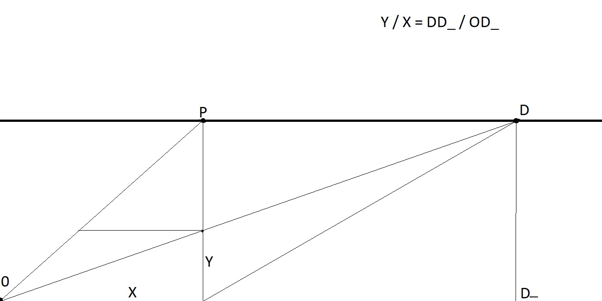
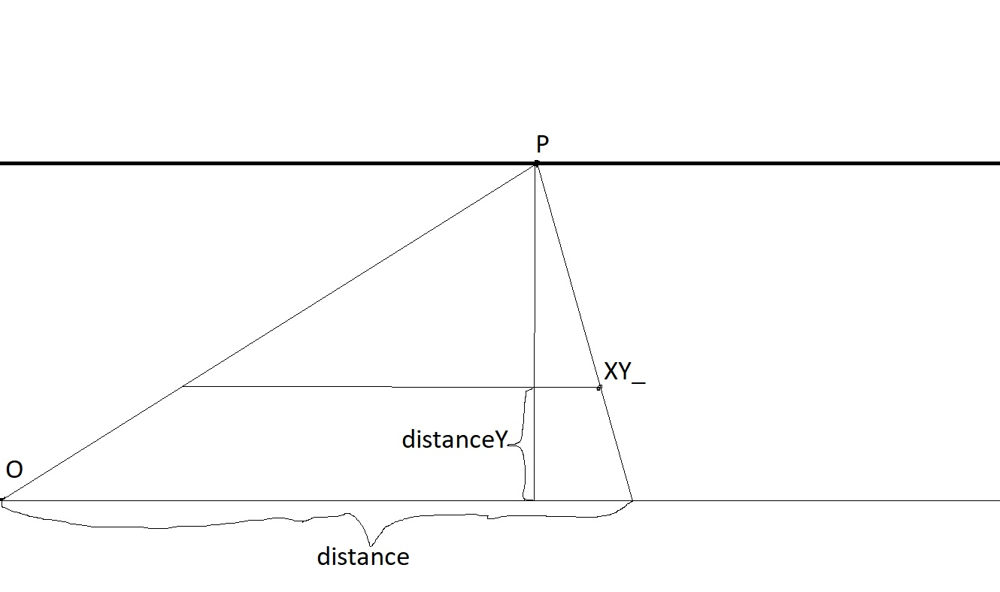
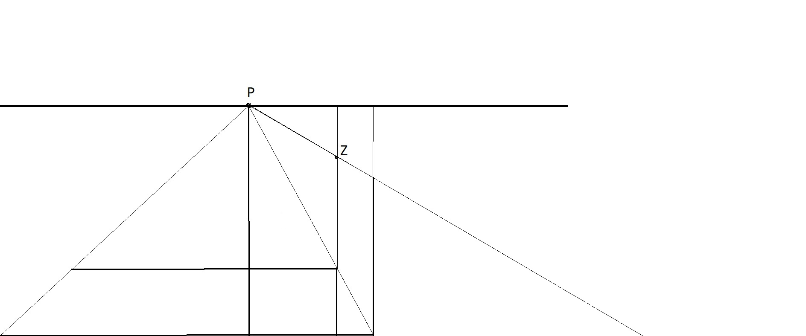

```js
function distanceY(distance) {
  const OD_ = distance + GlobalStorage.pd;
  const DD_ = GlobalStorage.canvasHeight - GlobalStorage.horizonY;

  return DD_ / OD_ * distance;
}
```

EN:  
Project the forward distance `distance` to screen-space Y using similar triangles.  
Let `D = canvasHeight - horizonY` be the fixed distance from the horizon line to the bottom of the canvas.  
Let `OD = distance + pd` be the ground distance from the observer to the point (including padding `pd`).  
Then the projected vertical offset is: `Y = (D / OD) * distance`.

RU:  
Проекция продольной дистанции `distance` в экранную ось Y по подобию треугольников.  
Пусть `D = canvasHeight - horizonY` — фиксированная дистанция от линии горизонта до низа канваса.  
Пусть `OD = distance + pd` — расстояние от наблюдателя до точки по земле (с учётом `pd`).  
Тогда проекция равна: `Y = (D / OD) * distance`.



---

```js
function distanceX(distance, distanceY) {
  const DD_ = GlobalStorage.canvasHeight - GlobalStorage.horizonY;
  const s = (DD_ - distanceY) / DD_;
  return GlobalStorage.horizonX + (distance - GlobalStorage.horizonX) * s;
}
```

EN:  
Project X using the same perspective scale as the horizontal pull toward the vanishing point.  
Scale factor: `s = (D - distanceY) / D`, where `D = canvasHeight - horizonY`.  
As `distanceY → D` (far), `s → 0` and `X → horizonX`; as `distanceY → 0` (near), `s → 1` and `X` stays near the original
`x`.

RU:  
Проецируем X тем же коэффициентом перспективы, что «тянет» точки к центру схода.  
Коэффициент: `s = (D - distanceY) / D`, где `D = canvasHeight - horizonY`.  
При `distanceY → D` (далеко) `s → 0` и `X → horizonX`; при `distanceY → 0` (близко) `s → 1`, и `X` почти равен исходному
`x`.



```js
function distanceZ(H, distanceY) {
  const DD_ = GlobalStorage.canvasHeight - GlobalStorage.horizonY;
  const s = (DD_ - distanceY) / DD_;
  return H * s;
}
```

EN:  
Project vertical size `Z` with the same perspective scale as for `X`.
Use `s = (D - distanceY) / D` with `D = canvasHeight - horizonY`. This keeps Z consistent with X and
avoids division-by-zero issues at the vanishing line.

RU:  
Проецируем вертикальный размер `Z` тем же коэффициентом, что и для `X`.  
Используем `s = (D - distanceY) / D`, где `D = canvasHeight - horizonY`. Это согласует Z с X и  
исключает деление на ноль на линии схода.  


